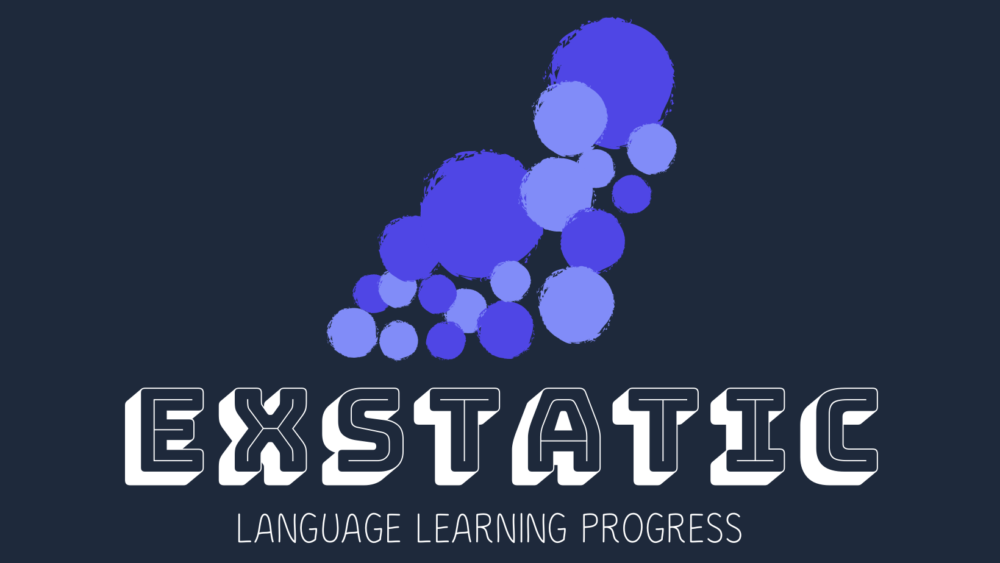
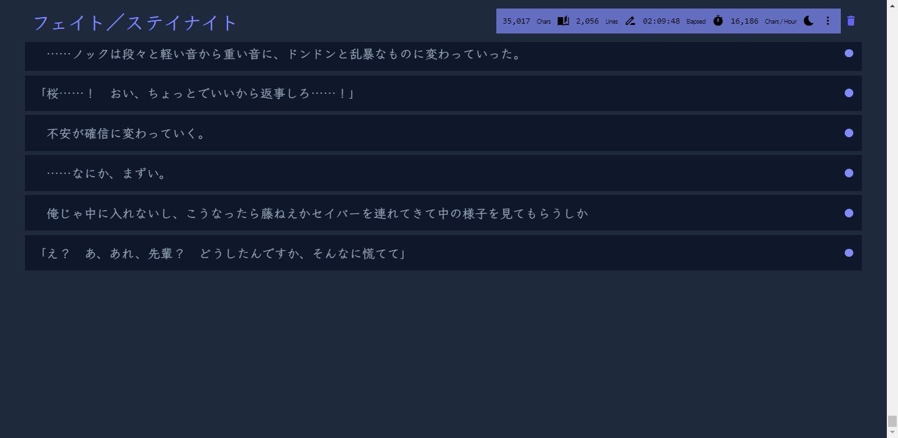
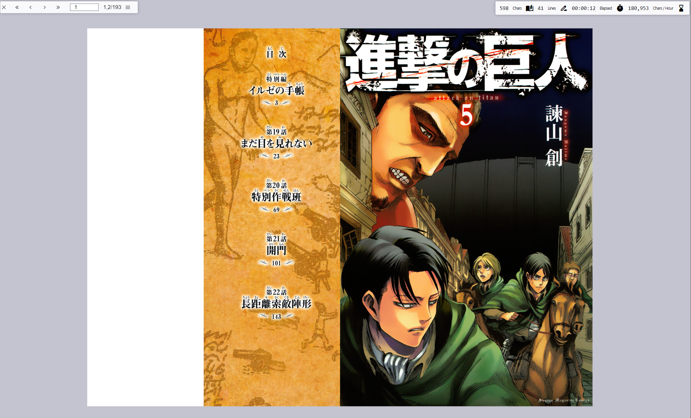
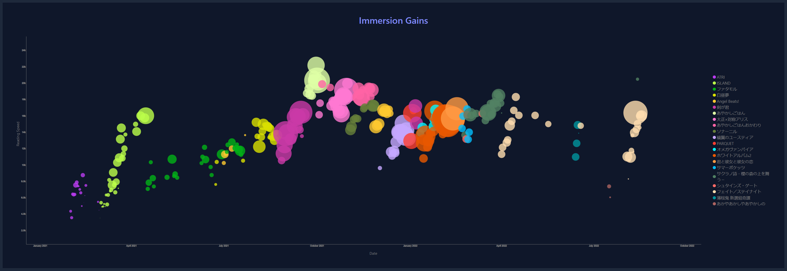
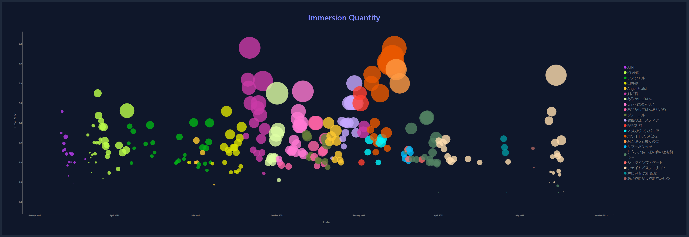
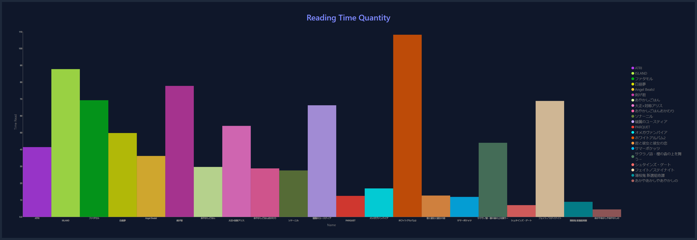
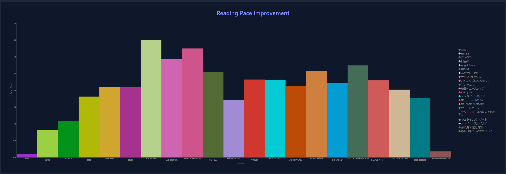

# Zero effort language learning IMMERSION statistic collection and visualisation!

exSTATic aims to make it easy for language learners to immerse in their target language without sacrificing high quality progress tracking.
exSTATic is a new project currently in its early stages and so is currently focused on smoothening out the Visual Novel (VN) reading experience.

The core web extension lies in this repository, whilst additional addons allow integration with various platforms:

* [TextractorSender](https://github.com/KamWithK/TextractorSender) - hooks VN lines and send them directly to exSTATic (or potentially other applications which wish to use the WebSocket connection, this doesn't impede/use a clipboard)
* Mokuro - included in the core extension

*Going forwards in the future, to account for other immersion mediums, integrations with other platforms like TTU, YouTube and maybe even Anki will be considered*

# Download Links
* Core WebExtension - [exSTATic](https://github.com/KamWithK/exSTATic/releases/latest)
* Textractor Extension - [TextractorSender](https://github.com/KamWithK/TextractorSender/releases/latest)

# Install Instructions

Setup is split into two parts:

1) Downloading & importing the browser extension - from this repository
2) Downloading & importing the integrations - from the repositories linked above

Once you download the files simply add them to your addons.
Start each one up and then navigate to the [main page](https://kamwithk.github.io/exSTATic/tracker.html).
Your stats should from then on be recorded!

[Video Tutorial](https://www.youtube.com/watch?v=MV2IlasgQQ4) (slightly outdated, light mode now works fine)

**WARNING:** If the main page isn't open your stats might not be recorded correctly, this has not yet been tested

**NOTE:** You may be warned on Chromium browsers that this extension uses the outdated Manifest V2 format, ignore this, Manifest V2 is officially still supported on both Firefox and Brave and so for the foreseeable future there are no plans to upgrade to V3 (due to technical complications)

# Usage Instructions

exSTATic works just like any other reading application for the most part, with a few features/changes to spice things up and help record high quality progress data at zero cost:

1. **Activity Timer** - Whenever you read what you're taking in will be recorded in the background and as you stop the time will stop being recorded
2. **Inactivity Indicators** - A slight blur over your media is added when the timer is off to ensure you always read with it on and have it off afterwards
3. **Manual Timer Toggling** - Double click the screen to manually toggle the timer on/off
4. **Stats and Graphs** - Data is taken for each media on a daily basis, and progress is visualised in various ways for various timeframes

*On a side note exSTATic makes use of modern technology to additionally eliminate a few other common painpoints with reading workflows like needing to use a clipboard (exSTATic doesn't use the clipboard and instead makes use of custom integrations)!*

**WARNING:** Textractor needs to be open with the TextractorSender extension at all times otherwise the extension will crash

# Manual Data Overrides

If you'd like to bring old data into exSTATic or modify the records in any way simply use the built in import/export buttons on the VN tracker UI (this works for all media forms).
Data should be formatted as csv and must look identical to the export (look at an export to see how it should look, some columns may be ignored).

# Mokuro Integration Notes

Mokuro support is currently being tested.
If you would like to give this a go please find your `manifest.json` file (within the exSTATic extension folder whereever that it) and alter the `matches` entries to match where you store your manga.
By default it is pre-set to pick up any manga within a folder anywhere called "Manga" (or any of its subdirectories, this may be removed and need to be manually entered in in future releases).

**NOTE:** Only single page mode works, double page mode is currently bugged

# Contributions
Feel free to fork this repository, create GitHub issues and pull requests.
More than happy to take a look into anything/approve PRs 😄!

Here's [my Ko-Fi](https://ko-fi.com/kamwithk) if you'd like to support.

To test and develop run:

1. `npm install` to set up the required packages
2. `web-ext run` to start a temporary instance of the extension, watch for changes and auto refresh the extension when they occur (OPTIONAL, manually import and refresh the extension otherwise)
3. `npm run build` to use the esbuild bundler

# Credits
Huge shoutout to everyone who helped on this project.
Thanks to Mae for helping design the UI (making sure it looks lit), helping with testing and giving lots of ideas for potentially useful features.

Cheers to Mae, Marv and Alex from The Moe Way for providing me with sample data to use for testing and showcasing stats for this project!

Credit to Tiberiu for providing some sample code for how TTU integration may work in the future.
Thanks ChibiDon for making a tutorial video for exSTATic.
